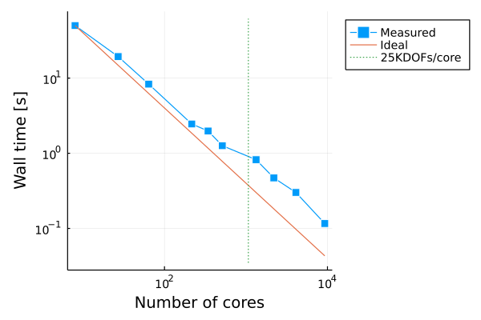

# DriverGadi.jl


## Dependencies

See the `Manifest.toml` and `modules.sh`. The latter one assumes that I have installed julia 1.6.3 in a certain location of my home folder (Gadi-provided julia 1.6.1 failed to compile SpecialFunctions).

## Setup

```
$ source modules.sh
$ julia --project=.
(DriverGadi) pkg> instantiate
(DriverGadi) pkg> precompile
$ qsub compilejob.sh
```
After 10 minutes approx you will have a sys image called `DriverGadi.so`

## Analysis

### Generate jobs

```
$ cd analysis
$ julia --project=.
(analysis) pkg> instantiate
(analysis) pkg> precompile
julia> include("preparejobs.jl")
```

### Launch jobs

Now you can use `qsub` to launch the jobs files generated within the `analysys/data` folder.

### Postproces results

Still from the `analysis` folder:

```
$ julia --project=.
julia> include("postprojobs.jl")

[ Info: Scanning folder /home/552/fv3851/DriverGadi/analysis/data for result files.
[ Info: Added 43 entries.
10×9 DataFrame
 Row │ np     nparts  nc     rnorm        ngdofs    wct        ngcells   ir     path                              
     │ Int64  Int64   Int64  Float64      Int64     Float64    Int64     Int64  String                            
─────┼────────────────────────────────────────────────────────────────────────────────────────────────────────────
   1 │     2       8    300  1.09423e-14  26730899  49.9914    27000000      1  /home/fverdugo/Code/jl/test/Driv…
   2 │     3      27    300  1.09205e-14  26730899  19.3319    27000000      1  /home/fverdugo/Code/jl/test/Driv…
   3 │     4      64    300  1.09797e-14  26730899   8.32443   27000000      1  /home/fverdugo/Code/jl/test/Driv…
   4 │     6     216    300  1.11691e-14  26730899   2.45398   27000000      1  /home/fverdugo/Code/jl/test/Driv…
   5 │     7     343    300  1.13177e-14  26730899   1.97739   27000000      1  /home/fverdugo/Code/jl/test/Driv…
   6 │     8     512    300  1.14182e-14  26730899   1.26188   27000000      1  /home/fverdugo/Code/jl/test/Driv…
   7 │    11    1331    300  1.15883e-14  26730899   0.821574  27000000      1  /home/fverdugo/Code/jl/test/Driv…
   8 │    13    2197    300  1.17594e-14  26730899   0.470309  27000000      1  /home/fverdugo/Code/jl/test/Driv…
   9 │    16    4096    300  1.19602e-14  26730899   0.301091  27000000      1  /home/fverdugo/Code/jl/test/Driv…
  10 │    21    9261    300  1.22386e-14  26730899   0.116248  27000000      1  /home/fverdugo/Code/jl/test/Driv…

```

At this point one can generate a strong scaling plot.
For convenience a preview of the figure is displayed at the REPL.
This is useful while working remotely in the cluster.

```

julia> include("plots.jl")
                 ┌────────────────────────────────────────┐             
      10^1.88822 │⠀⣀⠀⠀⠀⠀⠀⠀⠀⠀⠀⠀⠀⠀⠀⠀⠀⠀⠀⠀⠀⠀⠀⠀⠀⠀⠀⡄⠀⠀⠀⠀⠀⠀⠀⠀⠀⠀⠀⠀│ Measured    
                 │⠀⠈⠙⠦⣄⡀⠀⠀⠀⠀⠀⠀⠀⠀⠀⠀⠀⠀⠀⠀⠀⠀⠀⠀⠀⠀⠀⡇⠀⠀⠀⠀⠀⠀⠀⠀⠀⠀⠀⠀│ Ideal       
                 │⠀⠀⠀⠀⠈⠙⢕⡢⣀⠀⠀⠀⠀⠀⠀⠀⠀⠀⠀⠀⠀⠀⠀⠀⠀⠀⠀⡇⠀⠀⠀⠀⠀⠀⠀⠀⠀⠀⠀⠀│ 25KDOFs/core
                 │⠀⠀⠀⠀⠀⠀⠀⠈⠒⢕⠢⡀⠀⠀⠀⠀⠀⠀⠀⠀⠀⠀⠀⠀⠀⠀⠀⡇⠀⠀⠀⠀⠀⠀⠀⠀⠀⠀⠀⠀│             
                 │⠀⠀⠀⠀⠀⠀⠀⠀⠀⠀⠉⠪⣕⢄⡀⠀⠀⠀⠀⠀⠀⠀⠀⠀⠀⠀⠀⡇⠀⠀⠀⠀⠀⠀⠀⠀⠀⠀⠀⠀│             
                 │⠀⠀⠀⠀⠀⠀⠀⠀⠀⠀⠀⠀⠀⠑⠪⣒⢄⡀⠀⠀⠀⠀⠀⠀⠀⠀⠀⡇⠀⠀⠀⠀⠀⠀⠀⠀⠀⠀⠀⠀│             
                 │⠀⠀⠀⠀⠀⠀⠀⠀⠀⠀⠀⠀⠀⠀⠀⠀⠑⠬⡢⠤⣀⡀⠀⠀⠀⠀⠀⡇⠀⠀⠀⠀⠀⠀⠀⠀⠀⠀⠀⠀│             
   Wall time [s] │⠀⠀⠀⠀⠀⠀⠀⠀⠀⠀⠀⠀⠀⠀⠀⠀⠀⠀⠈⠑⢄⡈⠢⣄⡀⠀⠀⡇⠀⠀⠀⠀⠀⠀⠀⠀⠀⠀⠀⠀│             
                 │⠀⠀⠀⠀⠀⠀⠀⠀⠀⠀⠀⠀⠀⠀⠀⠀⠀⠀⠀⠀⠀⠈⠒⢄⠈⠉⠒⡧⢄⡀⠀⠀⠀⠀⠀⠀⠀⠀⠀⠀│             
                 │⠀⠀⠀⠀⠀⠀⠀⠀⠀⠀⠀⠀⠀⠀⠀⠀⠀⠀⠀⠀⠀⠀⠀⠀⠉⠢⣀⡇⠀⠈⠢⢄⡀⠀⠀⠀⠀⠀⠀⠀│             
                 │⠀⠀⠀⠀⠀⠀⠀⠀⠀⠀⠀⠀⠀⠀⠀⠀⠀⠀⠀⠀⠀⠀⠀⠀⠀⠀⠀⡗⠦⡀⠀⠀⠈⠑⠒⢄⠀⠀⠀⠀│             
                 │⠀⠀⠀⠀⠀⠀⠀⠀⠀⠀⠀⠀⠀⠀⠀⠀⠀⠀⠀⠀⠀⠀⠀⠀⠀⠀⠀⡇⠀⠈⠑⠢⣀⠀⠀⠀⠑⠤⡀⠀│             
                 │⠀⠀⠀⠀⠀⠀⠀⠀⠀⠀⠀⠀⠀⠀⠀⠀⠀⠀⠀⠀⠀⠀⠀⠀⠀⠀⠀⡇⠀⠀⠀⠀⠀⠑⠤⣀⠀⠀⠈⠀│             
                 │⠀⠀⠀⠀⠀⠀⠀⠀⠀⠀⠀⠀⠀⠀⠀⠀⠀⠀⠀⠀⠀⠀⠀⠀⠀⠀⠀⡇⠀⠀⠀⠀⠀⠀⠀⠀⠑⠤⡀⠀│             
       10^-1.554 │⠀⠀⠀⠀⠀⠀⠀⠀⠀⠀⠀⠀⠀⠀⠀⠀⠀⠀⠀⠀⠀⠀⠀⠀⠀⠀⠀⠇⠀⠀⠀⠀⠀⠀⠀⠀⠀⠀⠈⠀│             
                 └────────────────────────────────────────┘             
                 ⠀10^0.811183⠀Number of cores⠀⠀⠀10^4.05856⠀             

```

A plot image is also generated


